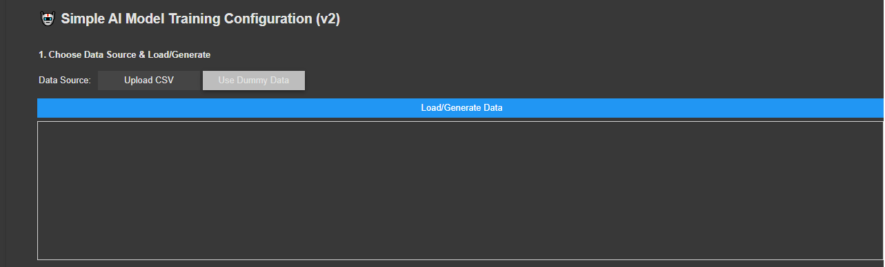
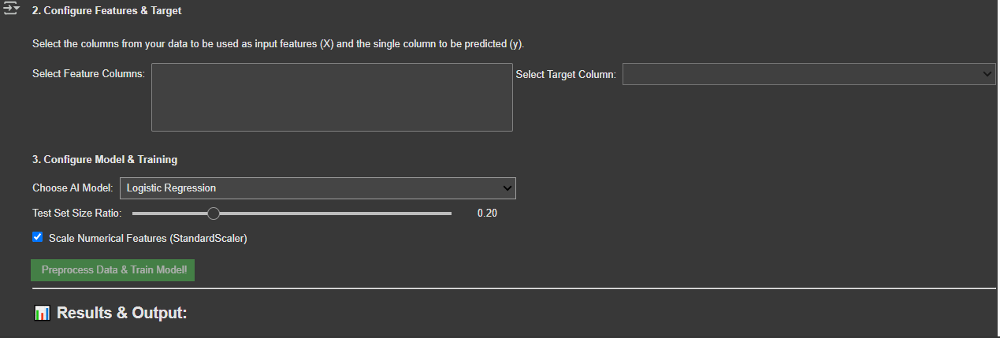

#  Interactive AI Model Trainer  🧪🤖

**Version:** 2.0.0
**Last Updated:** May 21, 2025

This Google Colab notebook provides a user-friendly, interactive environment for understanding the fundamental workflow of training basic Machine Learning classification models. It's designed for educational purposes to illustrate core concepts with a hands-on approach.

**Key Features:**
* **Dual Data Source:** Upload your own CSV files or generate synthetic dummy data for quick experimentation.
* **Interactive Configuration:** Easily select feature columns and the target variable using dropdowns.
* **Model Selection:** Choose from several common scikit-learn classifiers (Logistic Regression, Decision Tree, KNN, SVM, Random Forest).
* **Preprocessing Options:** Includes optional scaling for numerical features.
* **Train & Evaluate:** One-click training and display of key performance metrics like accuracy, classification report, and a confusion matrix.
* **User-Friendly UI:** Built with `ipywidgets` for an intuitive experience directly within Colab.

## Overview of the UI

This trainer provides a streamlined interface to guide you through the model training process.

### 1. Data Source & Loading/Generation

You can start by choosing whether to upload your own CSV or use a generated dummy dataset.

*(Image: `dsa.PNG` uploaded by the user, showing data source selection)*

*Caption: Select your data source and load or generate data.*

### 2. Feature, Target, and Model Configuration

Once data is loaded, you can configure your features, target variable, and choose your AI model along with training parameters.

*Caption: Configure features, target, model, and training parameters.*

## Purpose

The primary goal of this notebook is to allow users to:
1.  **Experiment** with different simple classification models.
2.  Understand the impact of **feature selection** and basic **preprocessing**.
3.  Get a feel for the **train/test cycle** and model **evaluation**.
4.  Learn these concepts without needing to write extensive boilerplate code.

**⚠️ Important Limitations:**
* This tool is for **educational purposes** and uses simple models for structured (tabular) data.
* It is **NOT** designed for complex tasks like deep learning, image/video processing, NLP, deepfake detection, or creating advanced AI systems.

## How It Works

1.  **Setup:** Run the initial cells to install libraries and define UI components.
2.  **Data Input (Cell 3 - UI):**
    * Choose "Upload CSV" or "Use Dummy Data".
    * Click "Load/Generate Data".
    * If uploading, select your CSV. A preview will appear.
3.  **Configuration (Cell 3 - UI):**
    * Select your feature columns and the target column from the dropdowns.
    * Choose an AI model from the list.
    * Adjust the Test Set Size Ratio.
    * Decide whether to scale numerical features.
4.  **Train & Evaluate (Cell 4 - Logic):**
    * Click the "Preprocess Data & Train Model!" button.
    * The notebook will preprocess the data, split it, train the selected model, and then display evaluation metrics (accuracy, classification report, confusion matrix) in the "Results & Output" section.

## Setup (within Google Colab)

1.  Open the notebook in Google Colab.
2.  Run the cells in order. The necessary Python libraries (`scikit-learn`, `pandas`, `numpy`, `matplotlib`, `seaborn`, `ipywidgets`) are installed automatically.
3.  No external API keys or special configurations are needed.

## Output

* **Status Messages:** Printed in the main output area during processing.
* **Data Previews:** Shown after data loading/generation.
* **Evaluation Metrics:** Training/Test Accuracy, Classification Report.
* **Visualizations:** Confusion Matrix plot.
* The trained model object is available in the Colab environment if you wish to inspect it further by adding more code cells, but this notebook primarily focuses on the UI-driven workflow.

